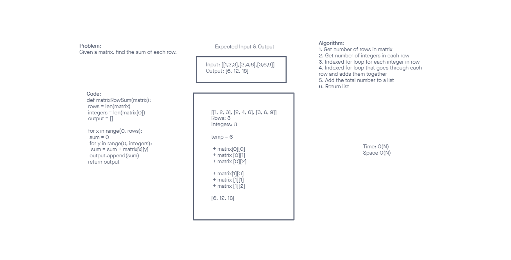

# Reverse an Array
<!-- Description of the challenge -->
Write a function to add up the sum of each row in a matrix of arbitrary size, and return an array with the appropriate values.
## Whiteboard Process
<!-- Embedded whiteboard image -->

## Approach & Efficiency
<!-- What approach did you take? Discuss Why. What is the Big O space/time for this approach? -->
My approach was to picture the general solution in my head and slowly develop each of the steps. 
